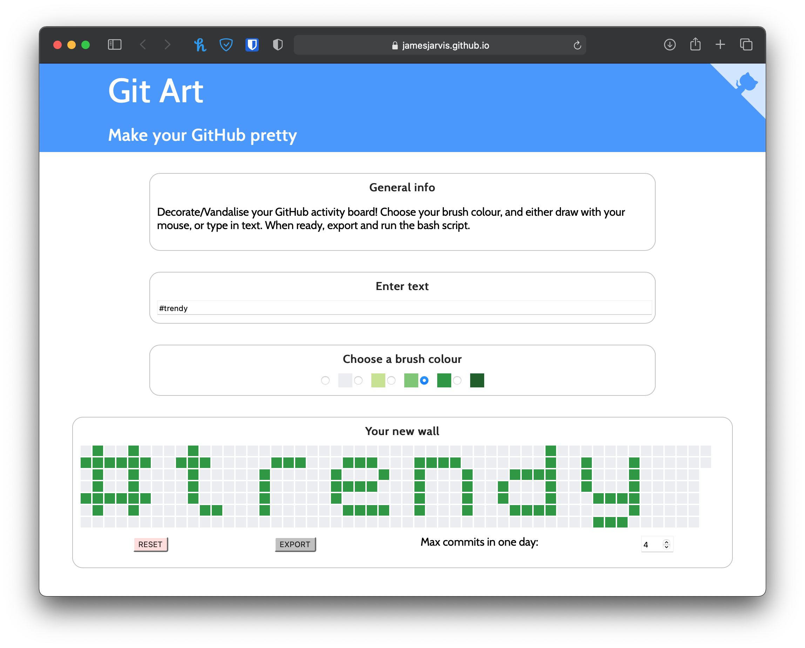
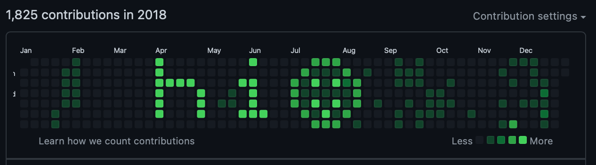

# Make your github pretty

[https://jamesjarvis.github.io/git-art/](https://jamesjarvis.github.io/git-art/)

[](https://jamesjarvis.github.io/git-art/)

[](https://github.com/jamesjarvis)

A project to allow anyone to customise their github activity/contributions graph with whatever they want.

Feel like adding some text? *Sure*

Feel like painting something onto it? **Go nuts**

Doesn't look fantastic at the moment, so feel free to submit a pull request where you just rm -rf. (That probably won't be approved, but a UI improvement would be much appreciated).
The license is what is says on the tin, fork off and have fun with the code.

## Local development

To run it locally:

```bash
yarn
yarn start
```

## Disclaimer

As always, be extra careful when downloading and running scripts from the internet. Even though all this does is make silly git repositories for you to ruin your git contribution board, and the source code is available here for you to scrutinise, you should **always** read through any script you download before you run it.

Other notable and very similar tools: [https://github.com/gelstudios/gitfiti](https://github.com/gelstudios/gitfiti)
